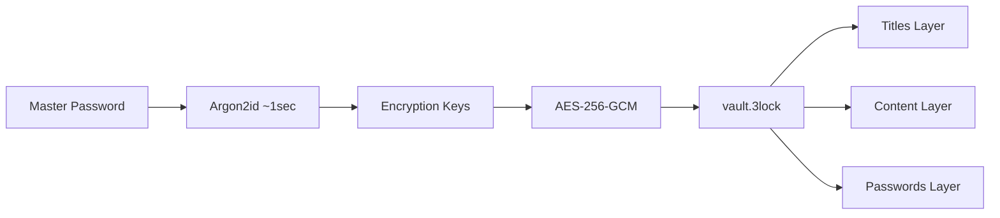

# 3Lock

**Private notes & passwords. Local. Encrypted. Simple.**

Minimalist encrypted storage for private notes and passwords. No server. No account. No cloud. Just one local file with your data.

Built for macOS. Cross-platform tech (Python/tkinter), Linux coming soon.

Website: [3lock.app](https://3lock.app)

## Problem

Password managers are bloated with features you don't need. They require accounts, subscriptions, and trust in third-party servers. If the service shuts down or gets breached, your data is at risk. Most are password-only. No place for private notes you just want encrypted.

## Solution

One encrypted file. One password. Works offline forever.



## How it works

1. **Create** - Set a master password, app creates encrypted vault at `~/.3lock/vault.3lock`
2. **Store** - Add notes with optional passwords, everything encrypted locally
3. **Use** - Copy passwords to clipboard (auto-clears in 30 sec)
4. **Backup** - One file, copy anywhere

## Features

- 🔐 AES-256-GCM encryption
- 🔑 Argon2id key derivation (~1 sec per attempt)
- 📋 Clipboard auto-clear (30 sec)
- ⏱️ Session timeout protection
- 📁 Single encrypted file - easy to backup
- 🔓 Open source - audit it yourself

## Install

**macOS (Apple Silicon):** Download [3Lock.dmg](https://github.com/kalba-lab/3lock/releases) → drag to Applications → right-click → Open (first time only, app is not notarized).

**From source:**
```bash
pip install -r requirements.txt
python -m threelock
```

⚠️ macOS system Python has Tk 8.5 bugs. Use `brew install python@3.11`

## Usage (from source)

```bash
python -m threelock                      # default vault ~/.3lock/vault.3lock
python -m threelock --vault ~/my.3lock   # custom vault location
python -m threelock --timeout 10         # session timeout in minutes (default: 5)
```

Default vault: `~/.3lock/vault.3lock`

## Tech

Python, tkinter, AES-256-GCM, Argon2id

## License

MIT
